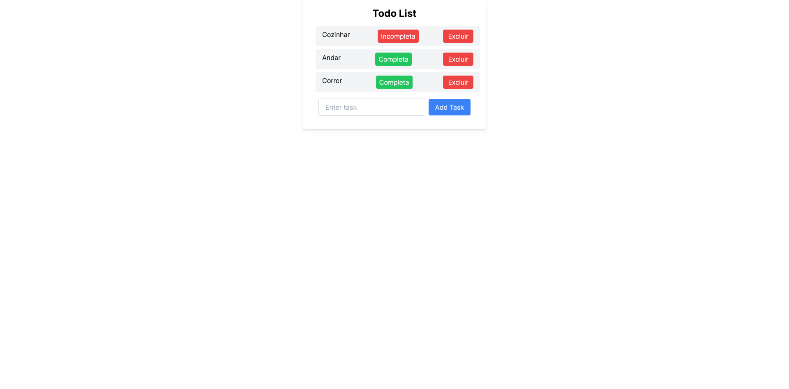

# Aplicação Next.js com Lista de Tarefas e Integração com Supabase

Este projeto é uma aplicação simples de lista de tarefas que utiliza o lado do cliente + servidor e o Supabase como provedor de banco de dados. A integração com o Supabase oferece uma solução eficiente e escalável para armazenar e gerenciar as tarefas, garantindo a persistência dos dados de maneira segura.

### Screenshot Desktop

### O Projeto

Os usuários devem ser capazes de:

 - Visualizar, adicionar e deletar uma tarefa da lista
 - Alterar o status da tarefa (completa ou incompleta)

### Links

- Link direto: [link do projeto](https://todo-supabase-one.vercel.app/)

## Construído com

- [Next.js](https://nextjs.org/) - React framework
- [Tailwind css](https://tailwindcss.com/) - Para estilização
- SupaBase - Provedor de Banco de dados
- React query - Realizar consultas http (CRUD)

## Autor

- Linkedin - [Vinicius Felipe](https://www.linkedin.com/in/vinicius-felipe-5148a81b5/)

Sinta-se à vontade para contribuir, abrir problemas ou fornecer feedback. Espero que este projeto seja útil e inspirador para outros desenvolvedores.
